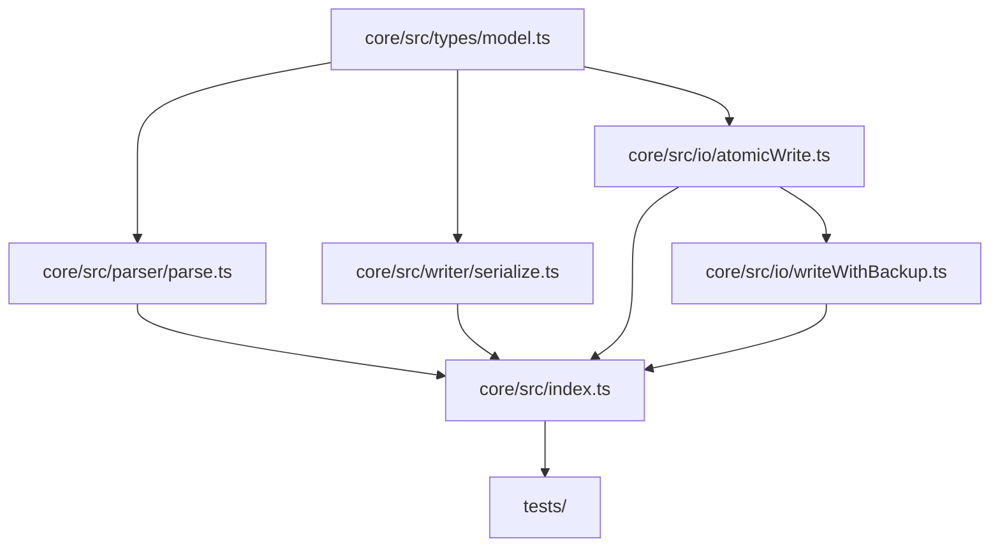
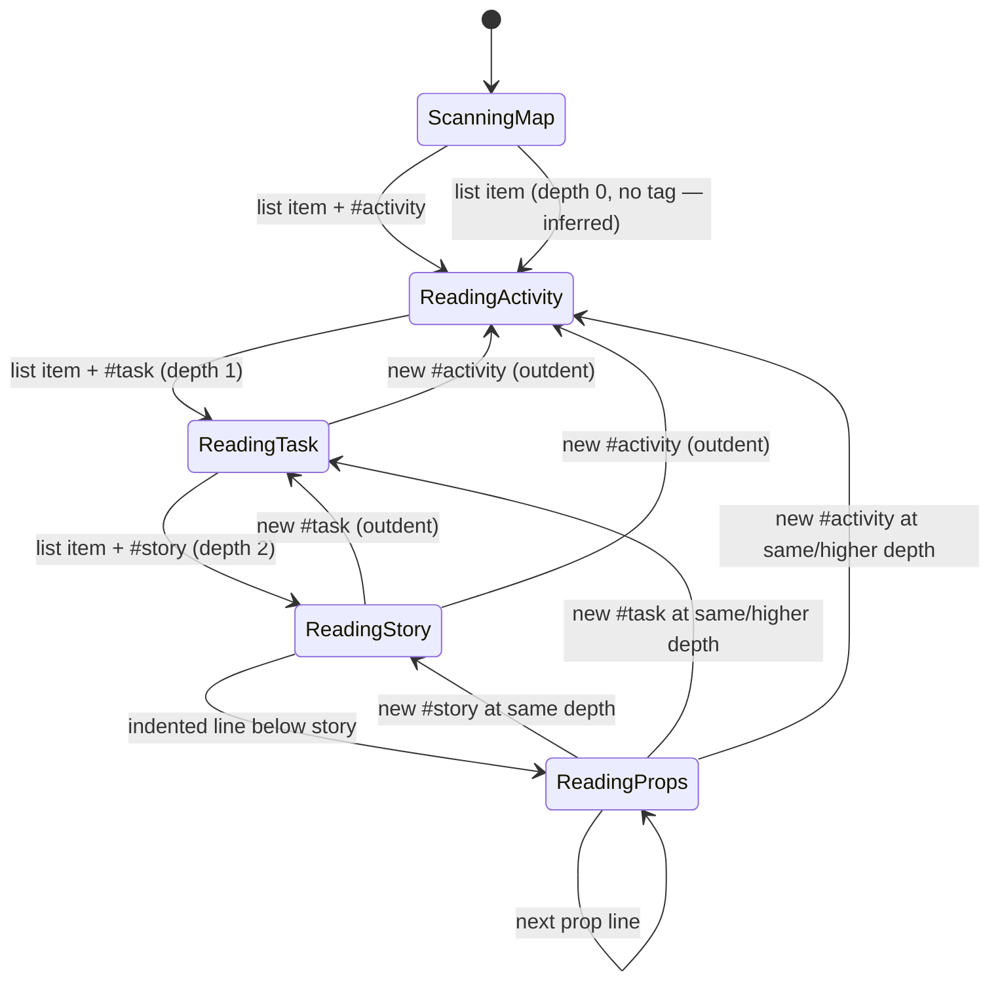

# PLAN — Core: Foundations (Phase 1)

**Date:** 2026-03-02
**REQ:** `.docs/reqs/2026/03/02/req-core-foundations.md`
**Status:** In Progress

---

## Architecture Overview

### Module Responsibilities

| Module | Exports | Notes |
|--------|---------|-------|
| `types/model.ts` | All TypeScript types | Already partially scaffolded; needs `unknownProps` field on Story |
| `parser/parse.ts` | `parse(md): StoryMap` | Stub exists; full implementation required |
| `writer/serialize.ts` | `serialize(map, mode): string` | Stub exists; full implementation required |
| `io/atomicWrite.ts` | `atomicWrite(path, content)` | New file |
| `io/writeWithBackup.ts` | `writeWithBackup(path, content)` | New file |
| `index.ts` | Re-exports all public API | Needs update for new IO exports |

### Parser State Machine

---

## Implementation Phases

### Phase 1A — Data Model (FR-C2)

- [x] **1A-1** Add `unknownProps: string[]` field to `Story` interface in `types/model.ts`
- [x] **1A-2** Add `rawLine: string` to `Activity` and `Task` to preserve verbatim source lines for round-trip
- [x] **1A-3** Verify all existing types compile cleanly under `strict: true`

> **Note:** The `model.ts` scaffold already has `Status`, `DocRefType`, `FormatMode`, `DocRef`, `Story`, `Task`, `Activity`, `StoryMap`. Changes are additive only.

---

### Phase 1B — Parser: Outline Detection (FR-C3.1, FR-C3.5)

- [x] **1B-1** Implement line-by-line scanner: track indentation depth to classify each line as activity / task / story / property / other
- [x] **1B-2** Strip `#activity`, `#task`, `#story` tags from titles; preserve other inline tags verbatim in `rawLine`
- [x] **1B-3** Parse map title from first `# Heading`; default to `'User Story Map'` if absent
- [x] **1B-4** Assign `order` field as insertion index within parent; for Story IDs generate from `slug` (fallback `story-<shortSuffix>`, append suffix on collision), then persist via `id::`
- [x] **1B-5** Assign `taskId` to each Story, `activityId` to each Task
- [x] **1B-6** Handle empty / whitespace-only input → return `{ title: 'User Story Map', activities: [] }`

---

### Phase 1C — Parser: Property Parsing (FR-C3.2, FR-C3.3, FR-C3.4)

- [x] **1C-1** Form A — detect `key:: value` lines indented below a `#story` line
  - Recognized scalar keys: `status`, `slug`, `id`
  - Recognized multi-value key: `notes` (accumulate lines, join with `\n`)
  - Recognized doc-ref keys: `req`, `plan`, `done` → parse `{date}/{filename}` → `DocRef`
  - Unrecognized keys → push raw line to `Story.unknownProps`
- [x] **1C-2** Form B — detect `status: value` and `slug: value` single-colon patterns
- [x] **1C-3** Form B doc-ref — detect `- {YYYY-MM-DD} → {filename}` lines; infer `DocRefType` from filename prefix
- [x] **1C-4** Apply defaults: `status='todo'`, `slug=''`, `notes=''`, `docRefs=[]`; if `id` is absent generate from slug with collision-safe suffix rules
- [x] **1C-5** Generate `id` for `Activity`, `Task` (not persisted to Markdown — session-stable via parse position; only `Story.id` is persisted)

---

### Phase 1D — Serializer: Preserve Mode (FR-C4.1, FR-C4.4)

- [x] **1D-1** For each story, compare current field values to parsed originals
- [x] **1D-2** Emit verbatim source lines for unmodified fields
- [x] **1D-3** Rewrite only lines whose field value has changed, using the same form (A or B) as the original
- [x] **1D-4** Emit `unknownProps` lines unchanged, in original order
- [x] **1D-5** Emit `id::` line for stories that had no `id::` on parse (new ID was assigned)
- [x] **1D-6** Preserve `#activity`, `#task`, `#story` markers and list indentation depths

---

### Phase 1E — Serializer: Normalize Mode (FR-C4.2)

- [x] **1E-1** Rewrite every story property block to Form A (`key:: value`)
- [x] **1E-2** Canonical field order: `id`, `status`, `slug`, `notes` (omit if empty), doc-ref lines (`req::`, `plan::`, `done::`), then `unknownProps`
- [x] **1E-3** Activity/Task title lines are emitted verbatim (only story prop blocks change)

---

### Phase 1F — IO Utilities (FR-C5)

- [x] **1F-1** Create `core/src/io/atomicWrite.ts`
  - Write to `{path}.tmp` via `fs.promises.writeFile`
  - Rename `.tmp` → `path` via `fs.promises.rename`
  - On rename failure: attempt `fs.promises.unlink` of `.tmp`, then throw
- [x] **1F-2** Create `core/src/io/writeWithBackup.ts`
  - If file exists: `fs.promises.copyFile(path, path + '.bak')`
  - On copy failure: throw immediately (do not proceed to write)
  - Call `atomicWrite(path, content)`
- [x] **1F-3** Update `core/src/index.ts` to export `atomicWrite` and `writeWithBackup`

---

### Phase 1G — Tests (FR-C1.3, AC-C1 through AC-C7)

Tests live in `core/tests/` split across four files. All run in Vitest Node environment (no DOM).

#### `tests/parser.test.ts` — FR-C3

**Outline detection (FR-C3.1)**
- [x] **1G-1** `parse('')` → `{ title: 'User Story Map', activities: [] }`
- [x] **1G-2** `parse(whitespaceOnly)` → same empty result
- [x] **1G-3** Single activity with one task and one story → correct `activities[0].tasks[0].stories[0]` shape
- [x] **1G-4** Multiple activities are parsed in document order; `order` equals insertion index
- [x] **1G-5** Multiple tasks under one activity are parsed in order; each has correct `activityId`
- [x] **1G-6** Multiple stories under one task are parsed in order; each has correct `taskId`
- [x] **1G-7** Map title taken from first `# Heading` line; absent heading defaults to `'User Story Map'`
- [x] **1G-8** `#activity`, `#task`, `#story` tags stripped from titles; remaining text is trimmed
- [x] **1G-9** Non-standard inline tags on Activity/Task lines preserved verbatim in `rawLine`
- [x] **1G-10** Fixture: parse excerpt of `docs/user-story-map.md` → verify activity count, task count, story slugs

**Form A properties (FR-C3.2)**
- [x] **1G-11** `status:: doing` → `story.status === 'doing'`
- [x] **1G-12** `slug:: my-slug` → `story.slug === 'my-slug'`
- [x] **1G-13** `id:: <id>` → `story.id === '<id>'` (existing ID preserved, not regenerated)
- [x] **1G-14** Single `notes:: some text` → `story.notes === 'some text'`
- [x] **1G-15** Multiple `notes::` lines → values joined with `\n`
- [x] **1G-16** `req:: 2026-01-01/req-foo.md` → `docRefs[0] === { type:'REQ', date:'2026-01-01', filename:'req-foo.md' }`
- [x] **1G-17** `plan:: 2026-02-01/plan-bar.md` → `docRefs` entry with `type:'PLAN'`
- [x] **1G-18** `done:: 2026-03-01/done-baz.md` → `docRefs` entry with `type:'DONE'`
- [x] **1G-19** Two `req::` lines on same story → two separate `DocRef` entries in order
- [x] **1G-20** Unrecognized key `foo:: bar` → raw line appears in `story.unknownProps`; not in any typed field
- [x] **1G-21** Multiple unrecognized keys → all captured in `unknownProps` in original order

**Form B legacy properties (FR-C3.3)**
- [x] **1G-22** `status: done` (single colon) → `story.status === 'done'`
- [x] **1G-23** `slug: my-slug` (single colon) → `story.slug === 'my-slug'`
- [x] **1G-24** `- 2026-01-15 → req-user-login.md` → `DocRef { type:'REQ', date:'2026-01-15', filename:'req-user-login.md' }`
- [x] **1G-25** `- 2026-01-15 → plan-foo.md` → `type:'PLAN'`
- [x] **1G-26** `- 2026-01-15 → done-bar.md` → `type:'DONE'`
- [x] **1G-27** `- 2026-01-15 → unknown-baz.md` (no known prefix) → `type:'DONE'`
- [x] **1G-28** Multiple `→` lines → multiple `DocRef` entries in order

**Defaults (FR-C3.4)**
- [x] **1G-29** Story with no `status` property → `status === 'todo'`
- [x] **1G-30** Story with no `slug` property → `slug === ''`
- [x] **1G-31** Story with no `notes` property → `notes === ''`
- [x] **1G-32** Story with no doc-ref lines → `docRefs === []`
- [x] **1G-33** Story with no `id::` and `slug:: my-slug` → `id === 'my-slug'`
- [x] **1G-34** Story with no `id::` and empty slug → `id` matches `story-<shortSuffix>` pattern
- [x] **1G-35** Two stories with same slug and no `id::` → first `id === slug`, second `id` gets `-<shortSuffix>` appended
- [x] **1G-36** Existing `id::` remains unchanged when `slug` value changes

**Robustness (FR-C3.6)**
- [x] **1G-37** Malformed property line (e.g. `::badline`) under a story → no crash; line appears in `unknownProps`
- [x] **1G-38** Property lines appearing before any `#story` tag → silently ignored, no crash
- [x] **1G-39** Deeply nested list beyond 3 levels → treated as property lines of the nearest parent story

---

#### `tests/serializer.test.ts` — FR-C4

**Preserve mode (FR-C4.1, FR-C4.4)**
- [x] **1G-40** Unmodified story → all original property lines emitted verbatim (byte-for-byte)
- [x] **1G-41** Modified `status` on Form A story → only the `status::` line changes; all other lines unchanged
- [x] **1G-42** Modified `slug` on Form A story → only the `slug::` line changes
- [x] **1G-43** Modified `notes` on Form A story → only `notes::` line(s) change
- [x] **1G-44** Added `DocRef` to Form A story → new `req::`/`plan::`/`done::` line appended; existing lines unchanged
- [x] **1G-45** Modified field on Form B story → line rewritten in Form B style (single colon), not Form A
- [x] **1G-46** `unknownProps` lines re-emitted in original order after typed fields
- [x] **1G-47** Story with no `id::` on parse → generated slug-based `id::` line written into output
- [x] **1G-48** `#activity`, `#task`, `#story` markers present in all serialized list items
- [x] **1G-49** List indentation depths match original (2-space or 4-space, whichever was parsed)
- [x] **1G-50** Non-standard tags on Activity/Task lines preserved verbatim

**Normalize mode (FR-C4.2)**
- [x] **1G-51** Form B story → all properties rewritten to `key:: value` in output
- [x] **1G-52** Field order: `id::`, `status::`, `slug::`, `notes::` (omitted if empty), doc-ref lines, `unknownProps`
- [x] **1G-53** `notes` is absent in output when `story.notes === ''`
- [x] **1G-54** Activity/Task title lines unchanged between preserve and normalize output
- [x] **1G-55** Normalize output contains no single-colon property patterns and no `→` doc-ref lines

**Round-trip invariant (FR-C4.3)**
- [x] **1G-56** `parse(serialize(parse(md), 'preserve'))` deep-equals `parse(md)` — Form A fixture
- [x] **1G-57** `parse(serialize(parse(md), 'preserve'))` deep-equals `parse(md)` — Form B fixture
- [x] **1G-58** `parse(serialize(parse(md), 'normalize'))` deep-equals `parse(md)` (field values identical, form differs)
- [x] **1G-59** No story, task, activity, or `unknownProps` line silently dropped in either mode

---

#### `tests/io.test.ts` — FR-C5

**`atomicWrite` (FR-C5.1)**
- [x] **1G-60** Normal write: target file contains expected content after call; no `.tmp` file remains
- [x] **1G-61** Write to non-existent path creates the file
- [x] **1G-62** On simulated rename failure: `.tmp` is cleaned up; original file content unchanged; error thrown
- [x] **1G-63** Thrown error is an `Error` instance with a non-empty `message` (FR-C5.3)

**`writeWithBackup` (FR-C5.2)**
- [x] **1G-64** When original file exists: `.bak` created with original content before write completes
- [x] **1G-65** `.bak` content matches the pre-write original exactly
- [x] **1G-66** When original file does not exist: write succeeds, no `.bak` created
- [x] **1G-67** On simulated backup copy failure: `atomicWrite` is NOT called; original file unchanged; error thrown
- [x] **1G-68** Successful call: final file has new content; `.bak` has old content
- [x] **1G-69** Thrown errors are `Error` instances with descriptive messages (FR-C5.3)

---

#### `tests/smoke.test.ts` — End-to-end (AC-C1 through AC-C7)

- [x] **1G-70** Full parse of `docs/user-story-map.md` completes without error and returns ≥ 1 activity
- [x] **1G-71** Round-trip `serialize(parse(fullFile), 'preserve')` → re-parse equals original model
- [x] **1G-72** `atomicWrite` + `writeWithBackup` imported and callable (public API surface check)
- [x] **1G-73** `npm test --workspace=core` exits 0 — all 73 tests green

---

### Phase 1H — Final Wiring & Build Verification

- [x] **1H-1** Run `npm run build --workspace=core` — no TypeScript errors
- [x] **1H-2** Confirm `dist/index.mjs`, `dist/index.cjs`, and `dist/index.d.ts` are emitted
- [x] **1H-3** Import `core` from `electron` workspace to verify resolution works end-to-end
- [x] **1H-4** Update `user-story-map.md` story statuses to `doing` for in-flight stories

---

## Key Design Decisions

### ID Persistence Strategy
`Story.id` is slug-seeded and persisted as `id:: <id>` in Markdown. On first creation: use `id = slug` when unique; on collision append `-<shortSuffix>`; if slug is empty use `story-<shortSuffix>`. Once written, `id` is immutable even if slug changes later. `Activity.id` and `Task.id` are generated fresh on each parse (session-stable, not persisted).

### Preserve Mode Implementation
The parser produces an internal `ParsedStory` type (not exported) that wraps `Story` and adds `_rawLines: string[]` (the verbatim source lines for the property block) and `_form: 'A' | 'B'`. The serializer uses `_rawLines` for unmodified fields and `_form` to rewrite changed fields in the correct style. `ParsedStory` is never exposed through the public `index.ts` API — callers always receive plain `Story` objects.

### `fs` vs Electron `ipcMain`
All I/O in Phase 1 uses `node:fs/promises` directly. In Phase 2, Electron IPC handlers will call these same utilities — no coupling in Phase 1.

---

## File Changeset

| File | Action |
|------|--------|
| `core/src/types/model.ts` | Update — add `unknownProps`, `rawLine` fields |
| `core/src/parser/parse.ts` | Replace stub with full implementation |
| `core/src/writer/serialize.ts` | Replace stub with full implementation |
| `core/src/io/atomicWrite.ts` | Create |
| `core/src/io/writeWithBackup.ts` | Create |
| `core/src/index.ts` | Update — add IO exports |
| `core/tests/smoke.test.ts` | Update — end-to-end AC tests (1G-70–73) |
| `core/tests/parser.test.ts` | Create — targeted parser tests (1G-1–39) |
| `core/tests/serializer.test.ts` | Create — targeted serializer tests (1G-40–59) |
| `core/tests/io.test.ts` | Create — targeted IO tests (1G-60–69) |
