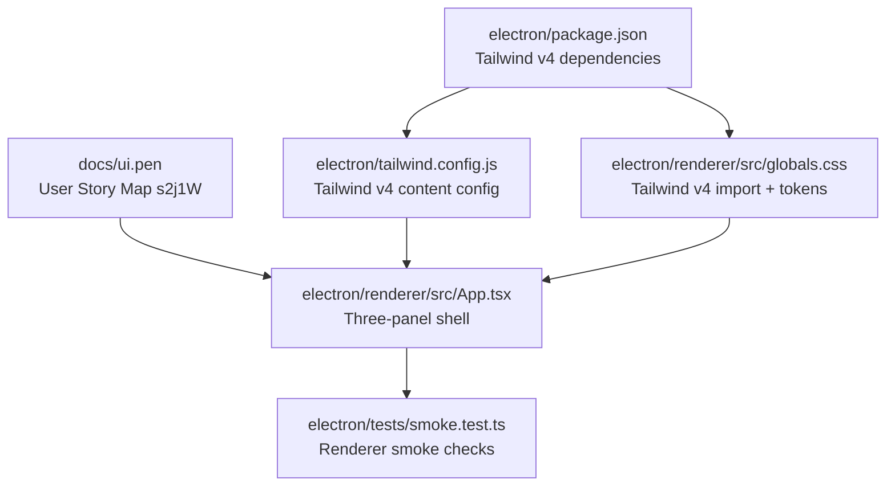

# PLAN — Electron Frontend: Three-Panel Layout

**Date:** 2026-03-02
**REQ:** `.docs/reqs/2026/03/02/req-electron-three-panel-frontend.md`
**Status:** In Progress (Updated Scope)

---

## Architecture Overview



### Layout Contract (from `ui.pen`)

- Canvas baseline: `1440x900`
- Left sidebar (`HM2Bw`): `240px`
- Center outliner (`Fm0Z8`): `880px` baseline, functionally flexible
- Right inspector (`wWbvv`): `320px` when enabled, optional at runtime

### Responsive Strategy

```mermaid
flowchart LR
    A[Desktop >= 1280] --> B[3 columns\n240 | flex | 320]
    C[Tablet 1024-1279] --> D[3 columns compressed\n240 | minmax center | 320]
    E[Small < 1024] --> F[Center prioritized\nSidebar/Inspector collapsible or overlay]
```

---

## Scope Update Delta

### Added Requirements

- Three-zone semantics updated to `left navigation rail / center workspace / optional right utility panel`.
- Desktop custom frameless-style title bar with explicit drag and non-drag regions.
- Draggable surfaces must exist on both top header and left-edge header strip.
- Sidebar must support expanded and collapsed density modes.
- Left slide-in side panel must be mode-driven (including `system-settings`) rather than route-driven.

### Plan Impact

- Prior completed phases remain valid for Tailwind v4 foundation and baseline shell.
- New implementation work is added as Phases 7-10 and is currently pending.

---

## Architecture Review Notes (AR)

### Resolved High-Priority Gaps

- Added explicit small-screen interaction behavior for sidebar and inspector.
- Added a minimal UI state contract to make responsive behavior deterministic.
- Added accessibility landmarks so the shell can be asserted in smoke tests.

### UI State Contract

- `isSidebarOpen: boolean` controls left panel visibility under narrow breakpoints.
- `isInspectorOpen: boolean` controls right panel visibility under narrow breakpoints.
- Desktop behavior keeps both side panels visible.
- Small-screen behavior keeps outliner visible while side panels are toggled overlays.

### Accessibility and Testability Contract

- Sidebar root uses `aside` with `aria-label="Sidebar"`.
- Outliner root uses `main` with `aria-label="Outliner"`.
- Inspector root uses `aside` with `aria-label="Inspector"`.
- Each panel header has visible heading text suitable for test assertions.

---

## Implementation Phases

### Phase 1 - Tailwind CSS v4 migration (FR-UI6)

- [x] **1-1** Upgrade renderer styling dependencies to Tailwind v4 compatible set in `electron/package.json`
- [x] **1-2** Update `electron/tailwind.config.js` for v4-compatible scanning and theme extension hooks
- [x] **1-3** Update `electron/renderer/src/globals.css` to Tailwind v4 entrypoint pattern
- [x] **1-4** Confirm renderer build starts successfully with v4 styles applied

### Phase 2 - Shell layout skeleton (FR-UI1, FR-UI2)

- [x] **2-1** Replace placeholder centered layout in `electron/renderer/src/App.tsx` with full-height app shell
- [x] **2-2** Implement three top-level columns with width contract: `240 / flex / 320`
- [x] **2-3** Add clear visual panel separation (borders and background zones)
- [x] **2-4** Ensure center outliner is the only flexible primary panel

### Phase 3 - Internal panel sections (FR-UI4)

- [x] **3-1** Add sidebar header + content structure
- [x] **3-2** Add outliner header + content structure
- [x] **3-3** Add inspector header + content structure
- [x] **3-4** Add placeholder panel content blocks to validate spacing hierarchy

### Phase 4 - Token and visual alignment (FR-UI1, FR-UI6, FR-UI7)

- [x] **4-1** Map core color intent from `ui.pen` variables into renderer CSS variables
- [x] **4-2** Apply variables via Tailwind utility usage for panel backgrounds, text, and borders
- [x] **4-3** Tune spacing and section rhythm to match `User Story Map` structure
- [x] **4-4** Verify no purple/default-template drift and preserve neutral product UI direction

### Phase 5 - Responsive behavior (FR-UI7)

- [x] **5-1** Define breakpoints and collapse strategy for sidebar/inspector on narrow widths
- [x] **5-1a** Implement toggle controls bound to `isSidebarOpen` and `isInspectorOpen`
- [x] **5-2** Keep outliner readable and interactive at reduced viewport sizes
- [x] **5-3** Validate overflow behavior within each panel (independent vertical scrolling)
- [x] **5-4** Ensure keyboard focus visibility remains clear across panels

### Phase 6 - Validation and tests (AC-UI1 to AC-UI6)

- [x] **6-1** Update or add renderer smoke assertions for shell and panel landmarks
- [x] **6-1a** Assert `aria-label` landmarks for Sidebar, Outliner, and Inspector
- [x] **6-2** Run `npm test --workspace=electron` and fix regressions
- [x] **6-3** Run `npm run build --workspace=electron` and confirm successful production build
- [x] **6-4** Verify acceptance criteria mapping against REQ before sign-off

### Phase 7 - Title bar drag architecture (FR-UI3)

- [x] **7-1** Define title bar surface model for frameless-style treatment in renderer header
- [x] **7-2** Mark broad top header and left-edge header strip as draggable regions
- [x] **7-3** Mark interactive controls as non-draggable, including sidebar collapse toggle
- [x] **7-4** Ensure title-bar controls are visually integrated into the app header surface

### Phase 8 - Left navigation density and mode panel (FR-UI5)

- [ ] **8-1** Implement sidebar density state: `expanded | collapsed`
- [ ] **8-2** Render full labels/metadata/actions only in expanded density
- [ ] **8-3** Render icon-first quick access in collapsed density
- [ ] **8-4** Implement slide-in left side panel with mode state, not route state
- [ ] **8-5** Add `system-settings` mode and baseline content scaffold

### Phase 9 - Optional right utility behavior (FR-UI2.5)

- [x] **9-1** Implement runtime toggle for right utility panel visibility
- [x] **9-2** Preserve center workspace usability and layout integrity when right panel is hidden
- [ ] **9-3** Validate width and overflow behavior for both panel-visible and panel-hidden states

### Phase 10 - Validation expansion (AC-UI7 to AC-UI10)

- [ ] **10-1** Add smoke assertions for optional right panel state transitions
- [ ] **10-2** Add smoke assertions for drag-region and no-drag control markers
- [ ] **10-3** Add smoke assertions for sidebar expanded vs collapsed density rendering
- [ ] **10-4** Add smoke assertions for mode-driven slide-in panel (`system-settings`)
- [ ] **10-5** Re-run `npm test --workspace=electron` and `npm run build --workspace=electron`

---

## File-Level Change Plan

| File | Planned Change |
|------|----------------|
| `electron/package.json` | Tailwind v4 dependency migration for renderer toolchain |
| `electron/tailwind.config.js` | Tailwind v4 config alignment and theme extension scaffold |
| `electron/renderer/src/globals.css` | Tailwind v4 import entry and design token variables |
| `electron/renderer/src/App.tsx` | Three-panel layout implementation based on `ui.pen` |
| `electron/tests/smoke.test.ts` | Add/adjust checks for panel shell presence |
| `electron/main.ts` | Ensure BrowserWindow/title-bar behavior supports frameless-style drag treatment |
| `electron/preload.ts` | Expose any required window-control hooks if needed by custom header controls |

---

## Risks and Mitigations

| Risk | Impact | Mitigation |
|------|--------|------------|
| Tailwind v4 migration friction with current Vite/PostCSS setup | Build breakage | Upgrade in isolated step and validate build before UI edits |
| Width contract causes clipping at smaller sizes | Poor usability | Use breakpoint-based collapse while preserving outliner priority |
| Overfitting to static `.pen` frame values | Fragile UI | Treat `240/320` as fixed rails and center as adaptive region |
| Renderer tests miss visual regressions | Undetected layout drift | Add structural smoke assertions for panel landmarks and classes |
| Incorrect drag/no-drag region assignment | Broken window dragging or control interaction issues | Add explicit class/attribute conventions and smoke assertions for markers |
| Density-mode complexity in sidebar | Navigation discoverability regressions | Keep density model explicit and test both modes in smoke coverage |

---

## Execution Order

1. Tailwind v4 migration and build validation
2. Three-column shell in `App.tsx`
3. Internal panel sectioning and token styling
4. Responsive behavior pass
5. Tests + build verification
6. Frameless-style title bar drag/no-drag treatment
7. Sidebar density and mode-driven slide-in panel
8. Optional right utility panel behavior + expanded tests

---

## Acceptance Mapping

| REQ Acceptance | Planned Validation |
|----------------|--------------------|
| AC-UI1 | Three persistent columns rendered with sidebar/outliner/inspector landmarks |
| AC-UI2 | Width contract verified at desktop baseline |
| AC-UI3 | Header and content sections present in each panel |
| AC-UI4 | Tailwind v4 dependency/config confirmed and used by renderer shell |
| AC-UI5 | Narrow-width behavior keeps center panel prioritized |
| AC-UI6 | Borders/background/spacing provide clear section separation |
| AC-UI7 | Right utility panel can be hidden while center workspace remains usable |
| AC-UI8 | Drag regions exist on top header and left-edge strip with no-drag controls |
| AC-UI9 | Sidebar density toggles correctly between expanded and collapsed renderings |
| AC-UI10 | Slide-in left panel is mode-driven and supports `system-settings` |
