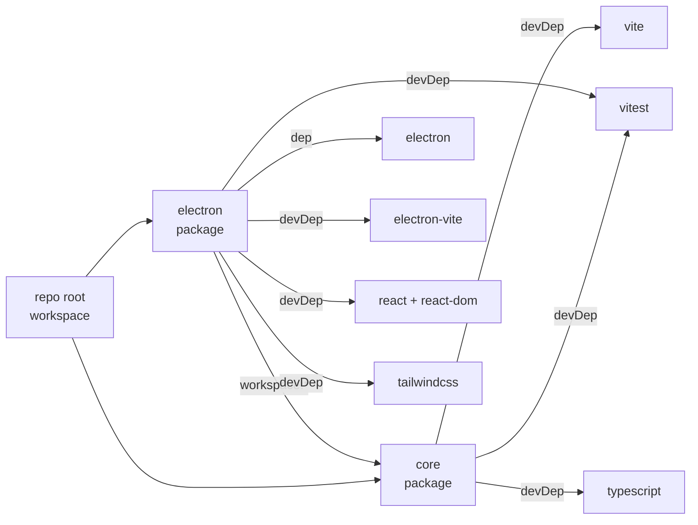
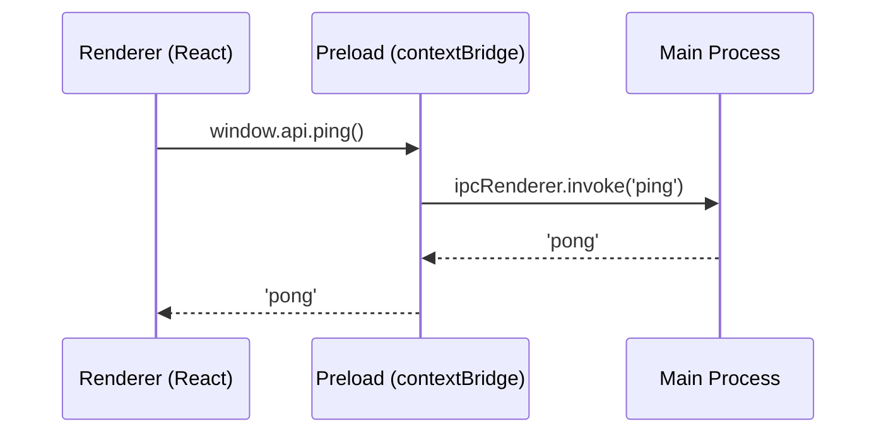

# Plan — Project Scaffold

**Date:** 2026-03-02  
**REQ:** `.docs/reqs/2026/03/02/req-project-scaffold.md`  
**Status:** Draft

---

## Repository Layout

```
rpd-command-center/            ← npm workspace root
├── package.json               ← workspaces: ["core", "electron"]
├── tsconfig.base.json         ← shared TS base config
├── eslint.config.mjs          ← shared flat ESLint config
├── .prettierrc                ← shared Prettier config
├── .nvmrc                     ← 20 (Node LTS pin)
│
├── core/                      ← plain TS library
│   ├── package.json
│   ├── tsconfig.json          ← extends ../../tsconfig.base.json
│   ├── vite.config.ts         ← lib mode → dist/index.cjs + dist/index.mjs
│   ├── src/
│   │   ├── index.ts           ← public re-exports
│   │   ├── types/
│   │   │   └── model.ts       ← all data model types + FormatMode
│   │   ├── parser/
│   │   │   └── parse.ts       ← stub: returns empty StoryMap
│   │   └── writer/
│   │       └── serialize.ts   ← stub: returns ""
│   └── tests/
│       └── smoke.test.ts      ← parse("") → valid StoryMap shape
│
└── electron/                  ← Electron app
    ├── package.json           ← depends on "core": "workspace:*"
    ├── tsconfig.json          ← extends ../../tsconfig.base.json
    ├── electron-vite.config.ts
    ├── electron/
    │   ├── main/
    │   │   ├── index.ts       ← BrowserWindow creation, IPC registration
    │   │   └── ipcHandlers.ts ← ping handler
    │   └── preload/
    │       └── index.ts       ← contextBridge → window.api
    ├── src/
    │   ├── index.html
    │   ├── main.tsx           ← ReactDOM.createRoot
    │   ├── App.tsx            ← minimal shell UI
    │   └── env.d.ts           ← window.api type augmentation
    └── tests/
        └── smoke.test.ts      ← window.api shape test (mocked ipc)
```

---

## Dependency Graph



---

## Key Configuration Details

### `tsconfig.base.json`
```json
{
  "compilerOptions": {
    "target": "ES2022",
    "module": "ESNext",
    "moduleResolution": "bundler",
    "strict": true,
    "declaration": true,
    "declarationMap": true,
    "sourceMap": true,
    "skipLibCheck": true
  }
}
```

### `core/tsconfig.json`
```json
{
  "extends": "../tsconfig.base.json",
  "compilerOptions": {
    "outDir": "dist",
    "lib": ["ES2022"]   // no DOM lib — enforces no DOM API usage
  },
  "include": ["src"]
}
```

### `electron/tsconfig.json`
Three tsconfig files as required by `electron-vite`:
- `tsconfig.json` — base for the workspace
- `tsconfig.node.json` — main + preload (Node/Electron env, no DOM)
- `tsconfig.web.json` — renderer (DOM lib, JSX react)

### `core/vite.config.ts` (lib mode)
```ts
import { defineConfig } from 'vite';
import { resolve } from 'path';
export default defineConfig({
  build: {
    lib: {
      entry: resolve(__dirname, 'src/index.ts'),
      formats: ['cjs', 'es'],
      fileName: (fmt) => `index.${fmt === 'es' ? 'mjs' : 'cjs'}`,
    },
    rollupOptions: { external: [] },
  },
});
```

`core/package.json` exports map must include a `types` condition so TypeScript consumers resolve declarations:
```json
"exports": {
  ".": {
    "import":  { "types": "./dist/index.d.mts", "default": "./dist/index.mjs" },
    "require": { "types": "./dist/index.d.ts",  "default": "./dist/index.cjs" }
  }
}
```

### Security baseline (`electron/main/index.ts`)
```ts
new BrowserWindow({
  webPreferences: {
    nodeIntegration: false,
    contextIsolation: true,
    // sandbox: true is ideal for production but conflicts with electron-vite
    // preload HMR injection in dev. Set via environment:
    sandbox: app.isPackaged,
    preload: join(__dirname, '../preload/index.js'),
  },
});
```

### `contextBridge` shape (`preload/index.ts`)
```ts
contextBridge.exposeInMainWorld('api', {
  ping: () => ipcRenderer.invoke('ping'),
});
```
`window.api` type is augmented in `src/env.d.ts`; raw `ipcRenderer` is never exposed.

### Tailwind (`electron` renderer)
- `tailwind.config.js` with `content: ['./src/**/*.{ts,tsx}']`
- `@tailwind base/components/utilities` imported in `src/main.tsx` or a global CSS file

### Root scripts (`package.json`)
```json
{
  "scripts": {
    "dev":   "npm run dev --workspace=electron",
    "build": "npm run build --workspace=core && npm run build --workspace=electron",
    "test":  "npm test --workspaces --if-present",
    "lint":  "eslint ."
  }
}
```
> Note: `--workspaces` (plural) runs the script in every workspace; `--workspace=<name>` (singular) targets one.

---

## IPC Ping/Pong Flow



---

## Data Model Stubs (`core/src/types/model.ts`)

All types defined here; `parse` and `serialize` return typed stubs so downstream imports compile correctly from day one:

```ts
export type Status = 'todo' | 'doing' | 'done';
export type DocRefType = 'REQ' | 'PLAN' | 'DONE';
export type FormatMode = 'preserve' | 'normalize';

export interface DocRef { id: string; type: DocRefType; date: string; filename: string; }
export interface Story  { id: string; taskId: string; title: string; status: Status; slug: string; notes: string; order: number; updatedAt: number; docRefs: DocRef[]; }
export interface Task   { id: string; activityId: string; title: string; order: number; stories: Story[]; }
export interface Activity { id: string; title: string; order: number; tasks: Task[]; }
export interface StoryMap { title: string; activities: Activity[]; }
```

---

## Implementation Checklist

### Step 1 — Root workspace
- [x] Create root `package.json` with `"workspaces": ["core", "electron"]`, `"private": true`
- [x] Create `tsconfig.base.json`
- [x] Create `.prettierrc`
- [x] Create `eslint.config.mjs` (flat config using `typescript-eslint` v8 — package: `typescript-eslint`, which re-exports both plugin and parser as a unified package)
- [x] Create `.nvmrc` (`20`)
- [x] Add root `dev`, `build`, `test`, `lint` scripts

### Step 2 — `core` package
- [x] Create `core/package.json` (`name: "core"`, `"type": "module"`, exports map for CJS+ESM)
- [x] Create `core/tsconfig.json` (extends base, no DOM lib)
- [x] Create `core/vite.config.ts` (lib mode, CJS+ESM outputs)
- [x] Create `core/src/types/model.ts` with all types
- [x] Create `core/src/parser/parse.ts` (stub returning empty `StoryMap`)
- [x] Create `core/src/writer/serialize.ts` (stub returning `""`)
- [x] Create `core/src/index.ts` (re-export everything)
- [x] Create `core/tests/smoke.test.ts`
- [x] Verify `npm run build --workspace=core` produces `dist/index.cjs` + `dist/index.mjs`

### Step 3 — `electron` package
- [x] Create `electron/package.json` with `"core": "*"` dependency (npm workspaces; `workspace:*` is pnpm/Yarn syntax)
- [x] Create `electron/tsconfig.json`, `tsconfig.node.json`, `tsconfig.web.json`
- [x] Create `electron-vite.config.ts`
- [x] Create `electron/main/index.ts` — `BrowserWindow` with security baseline
- [x] Create `electron/main/ipcHandlers.ts` — register `ping` handler
- [x] Create `electron/preload/index.ts` — `contextBridge` exposing `{ ping }`
- [x] Create `electron/src/env.d.ts` — `window.api` type augmentation
- [x] Create `electron/src/index.html`
- [x] Create `electron/src/main.tsx` — `ReactDOM.createRoot`
- [x] Create `electron/src/App.tsx` — minimal shell (`<h1>RPD Command Center</h1>`)
- [x] Configure Tailwind (config + global CSS import)
- [x] Create `electron/tests/smoke.test.ts` — mock IPC, verify `window.api` shape
- [ ] Verify `npm run dev` opens Electron window

### Step 4 — Verify all ACs
- [x] AC-1: `npm run dev` launches window
- [x] AC-2: Edit `App.tsx` → renderer updates without Electron restart
- [x] AC-3: `npm test` passes both smoke tests
- [x] AC-4: Call `window.api.ping()` in DevTools console → returns `'pong'`
- [x] AC-5: `npm run build --workspace=core` succeeds with no Electron/DOM imports
- [x] AC-6: `npm run lint` exits 0
- [x] AC-7: Confirm `nodeIntegration: false`, `contextIsolation: true` in source
- [x] AC-8: `core` importable from `electron` renderer at runtime
