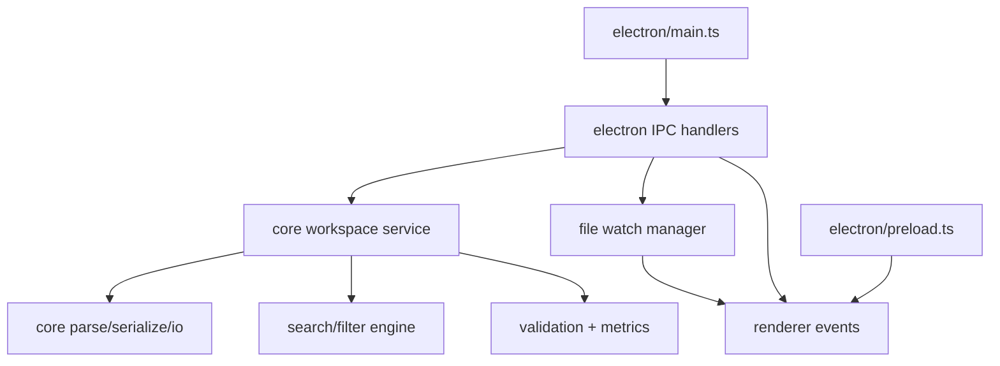
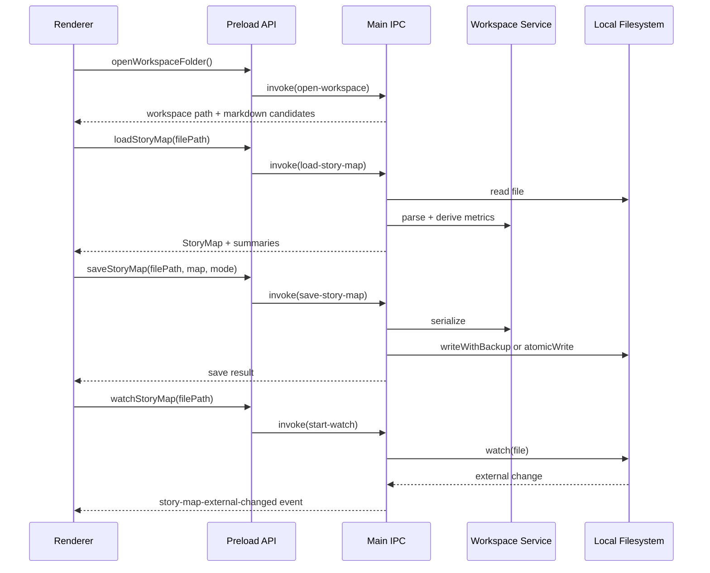

# PLAN — Core: File & Workspace (Phase 2)

**Date:** 2026-03-03
**REQ:** `.docs/reqs/2026/03/03/req-phase2-core-file-workspace.md`
**Status:** Draft (AP complete, AR reviewed)

---

## Architecture Overview

### Runtime Flow

---

## Key Design Decisions

- IPC boundary stays in Electron layer; all business logic stays in pure TypeScript modules.
- Workspace service returns typed result envelopes (`ok`, `error`) instead of throwing across renderer boundaries.
- Search/filter/metrics operate on parsed `StoryMap` data; they do not mutate source data.
- Watch lifecycle is explicit (`start/stop/replace`) to avoid duplicate watchers and event leaks.
- Save path uses existing `core` guarantees (`atomicWrite`, `writeWithBackup`) as the only write mechanism.

---

## Implementation Phases

### Phase 2A - Core workspace logic module (FR-W3, FR-W4, FR-W5, FR-W6, FR-W7.2)

- [x] **2A-1** Add a new headless module under `core/src/workspace/` for search, filters, validations, and metrics.
- [x] **2A-2** Define shared request/response types for:
  - Text search input and result set
  - Filter options and matched story IDs
  - Slug validation response
  - Activity/task metric summaries
- [x] **2A-3** Implement case-insensitive full-text matching across `title`, `slug`, `notes`, and doc filenames.
- [x] **2A-4** Implement composable filter evaluator (status multi-select, doc-coverage, unfinished-only).
- [x] **2A-5** Implement slug format and uniqueness checks with optional `excludeStoryId`.
- [x] **2A-6** Implement deterministic metrics calculators for status counts, percent-done, and doc-coverage.
- [x] **2A-7** Export new APIs via `core/src/index.ts`.

### Phase 2B - Main-process file and workspace IPC (FR-W1, FR-W7.1, FR-W7.3)

- [x] **2B-1** Add IPC contract constants/types in Electron main layer for workspace actions.
- [x] **2B-2** Implement `open-workspace` handler (folder picker + markdown candidate list).
- [x] **2B-3** Implement `load-story-map` handler (read file, parse map, return map + derived summaries).
- [x] **2B-4** Implement `save-story-map` handler (serialize by mode, atomic+backup toggle).
- [x] **2B-5** Implement compute handlers for search/filter/slug/metrics if not bundled into `load` responses.
- [x] **2B-6** Standardize IPC success/error envelopes and map exceptions to user-safe error payloads.

### Phase 2C - External file watch management (FR-W2)

- [x] **2C-1** Implement watcher registry keyed by BrowserWindow/webContents and file path.
- [x] **2C-2** Implement `start-watch-story-map` to begin watching current file.
- [x] **2C-3** Implement `stop-watch-story-map` and automatic replacement when file changes.
- [x] **2C-4** Emit renderer event with file identity on external changes.
- [x] **2C-5** Surface watcher errors through dedicated event channel.
- [x] **2C-6** Ensure watcher cleanup on window close and app shutdown.

### Phase 2D - Preload bridge and renderer contract surface (FR-W1, FR-W2, FR-W7.1)

- [x] **2D-1** Extend `electron/preload.ts` with typed APIs for open/load/save/watch/search/filter/validate/metrics.
- [x] **2D-2** Add event subscription helpers for external-change and watch-error notifications.
- [x] **2D-3** Update renderer `env.d.ts` window API typings to match preload surface.
- [x] **2D-4** Keep API minimal and explicit; do not expose raw `ipcRenderer`.

### Phase 2E - Tests and verification (AC-W1 to AC-W9, NFR-W6)

- [x] **2E-1** Add `core` tests for search/filter composition scenarios.
- [x] **2E-2** Add `core` tests for slug validation edge cases and duplicate detection.
- [x] **2E-3** Add `core` tests for activity/task metrics outputs, including zero-story nodes.
- [x] **2E-4** Add Electron main-process tests for open/load/save IPC handlers.
- [x] **2E-5** Add Electron tests for watch start/replace/stop and event emission behavior.
- [x] **2E-6** Run `npm test --workspace=core` and `npm test --workspace=electron`.
- [x] **2E-7** Run `npm run build --workspace=core` and `npm run build --workspace=electron`.

---

## File-Level Change Plan

| File | Planned Change |
|------|----------------|
| `core/src/workspace/*` | New: headless search/filter/validation/metrics modules |
| `core/src/index.ts` | Update exports for workspace logic |
| `core/tests/*` | Add Phase 2 coverage for workspace logic |
| `electron/main.ts` | Add IPC handlers + watcher lifecycle management |
| `electron/preload.ts` | Expose typed workspace APIs and event listeners |
| `electron/renderer/src/env.d.ts` | Extend `window.api` type contract |
| `electron/tests/*` | Add IPC and watcher tests |

---

## AR Review Loop

### Review Findings

- **High Risk 1: Event storms from file watchers**
  - Risk: editors may emit multiple filesystem events per save, causing duplicate reload prompts.
  - Resolution: define event coalescing behavior at watch-manager layer.

- **High Risk 2: Non-deterministic ordering in search/filter results**
  - Risk: unstable ordering can make UI jumpy and tests flaky.
  - Resolution: require deterministic output ordering by `activity.order`, `task.order`, `story.order`.

- **High Risk 3: Ambiguous percent-done semantics for empty nodes**
  - Risk: inconsistent UI interpretation.
  - Resolution: specify `percentDone = 0` when story count is 0.

- **High Risk 4: Filter semantics around doc coverage**
  - Risk: inconsistent backend/frontend interpretation for `none` and typed doc filters.
  - Resolution: define strict semantics:
    - `none`: stories with zero doc refs.
    - `has-req`: at least one `REQ` doc ref.
    - `has-plan`: at least one `PLAN` doc ref.
    - `has-done`: at least one `DONE` doc ref.

### AR Updates Applied to Plan

- Coalesced watcher events included in Phase `2C` implementation expectations.
- Deterministic ordering requirement reinforced in Phase `2A` and test phase `2E`.
- Empty-node metric semantics fixed at `0` percent done.
- Doc-coverage filter semantics made explicit.

### Exit Condition

No unresolved major architectural flaws remain for Phase 2 implementation kickoff.

---

## Acceptance Mapping

| REQ Acceptance | Planned Validation |
|----------------|--------------------|
| AC-W1 | `open-workspace` IPC returns selected folder + markdown candidates |
| AC-W2 | `load-story-map` IPC returns parsed model and summaries |
| AC-W3 | `save-story-map` uses selected mode and atomic/backup behavior |
| AC-W4 | File watcher emits external-change event consumed by renderer API |
| AC-W5 | Search tests prove correct matching across title/slug/notes/docs |
| AC-W6 | Filter tests prove correct composed filtering behavior |
| AC-W7 | Validation tests prove character and duplicate conflict detection |
| AC-W8 | Metrics tests prove status counts and percent-done outputs |
| AC-W9 | Core + electron test suites cover IPC and logic behaviors |

---

## Execution Order

1. Implement headless workspace logic in `core`.
2. Wire Electron IPC handlers for open/load/save.
3. Add watcher lifecycle and external-change events.
4. Extend preload and renderer-facing type contracts.
5. Add and run full test/build verification.
