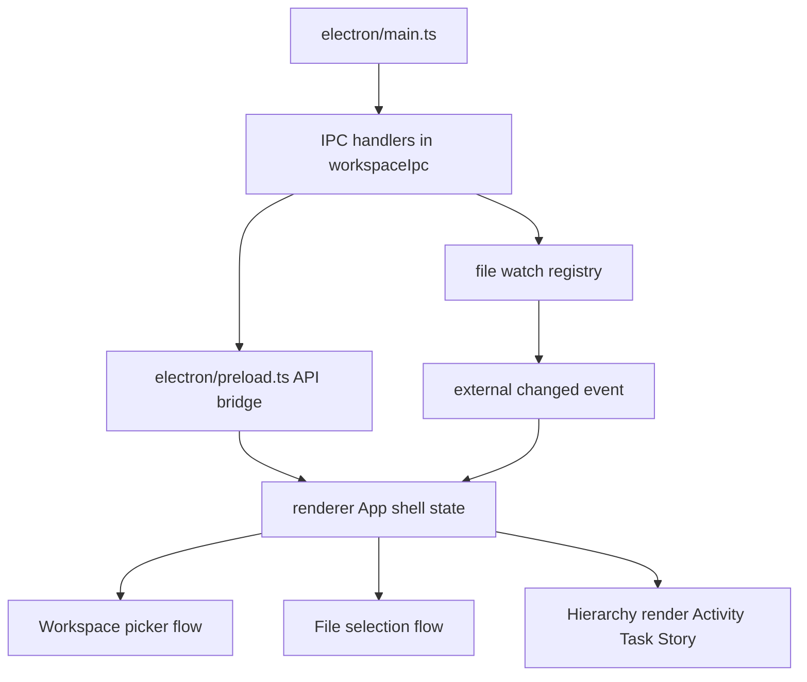
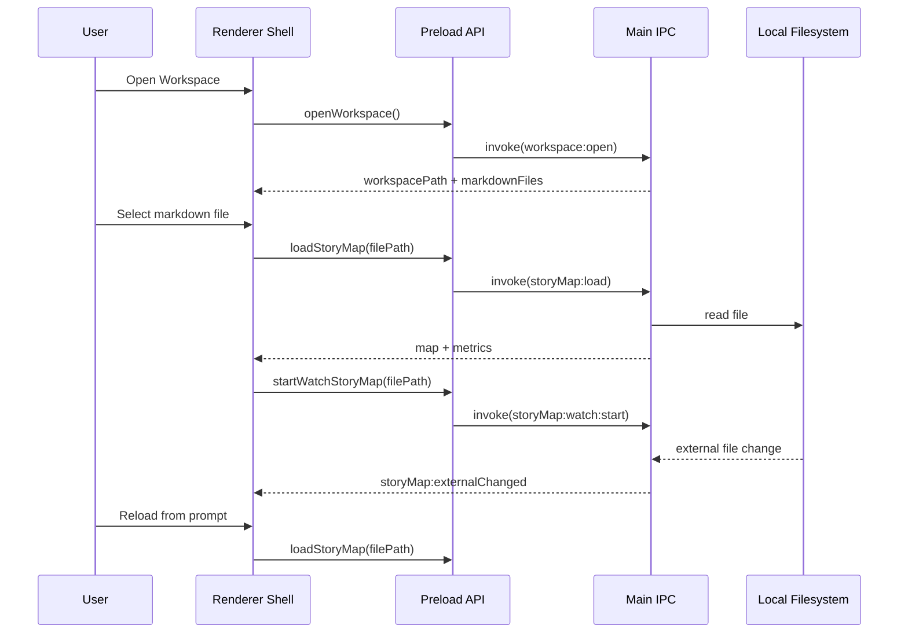

# PLAN — Frontend: App Shell (Phase 4)

**Date:** 2026-03-03
**REQ:** `.docs/reqs/2026/03/03/req-phase4-frontend-app-shell.md`
**Status:** Completed (SS complete, TT complete)

---

## Architecture Overview

### Runtime Flow

---

## Implementation Phases

### Phase 4A - Shell state and contracts (FR-SH1, FR-SH2, FR-SH7)

- [x] **4A-1** Define renderer state contract for workspace context, active file, loading, and error conditions.
- [x] **4A-2** Add typed wrappers for preload calls used by Phase 4 shell operations.
- [x] **4A-3** Ensure renderer uses preload API only and never accesses raw Electron/Node APIs directly.
- [x] **4A-4** Add resilient success/error handling paths for all async operations.

### Phase 4B - Workspace folder dialog flow (FR-SH3)

- [x] **4B-1** Implement "Open Workspace" action in renderer shell.
- [x] **4B-2** Persist selected workspace context in shell state for display.
- [x] **4B-3** Render markdown file candidate list from workspace results.
- [x] **4B-4** Handle cancel and failure paths without breaking existing UI state.

### Phase 4C - Story-map file selection and load (FR-SH4)

- [x] **4C-1** Implement active-file selection from workspace markdown candidates.
- [x] **4C-2** Load selected file via IPC and store returned `StoryMap` payload.
- [x] **4C-3** Surface current workspace + active file identity in shell header/sidebar region.
- [x] **4C-4** Display actionable load-error states and retry affordance.

### Phase 4D - Basic hierarchy rendering (FR-SH5)

- [x] **4D-1** Render nested hierarchy in order: Activity -> Task -> Story.
- [x] **4D-2** Ensure hierarchy refreshes after each successful load.
- [x] **4D-3** Provide explicit empty states for no workspace, no markdown files, and empty parsed map.
- [x] **4D-4** Keep rendering logic read-only and scoped to shell behavior only.

### Phase 4E - External file watch and reload prompt (FR-SH6, FR-SH7)

- [x] **4E-1** Start file watch when active story-map file is selected.
- [x] **4E-2** Replace/stop previous watch context when switching files/workspaces.
- [x] **4E-3** Handle external-change events with a visible reload prompt.
- [x] **4E-4** Implement reload-now action that re-loads current file and updates hierarchy.
- [x] **4E-5** Implement dismiss action that keeps current in-memory view unchanged.

### Phase 4F - Tests and verification (AC-SH1 to AC-SH8)

- [x] **4F-1** Add renderer tests for workspace open and markdown candidate presentation states.
- [x] **4F-2** Add renderer tests for active-file selection and hierarchy render states.
- [x] **4F-3** Add renderer tests for external-change prompt visibility and action outcomes.
- [x] **4F-4** Add/adjust integration smoke tests to validate preload API usage boundaries.
- [x] **4F-5** Run `npm test --workspace=electron` and resolve failures.
- [x] **4F-6** Run `npm run build --workspace=electron` and verify successful build.

---

## File-Level Change Plan

| File | Planned Change |
|------|----------------|
| `electron/renderer/src/App.tsx` | Replace static mock shell behavior with Phase 4 workspace/file/load/watch flow |
| `electron/renderer/src/env.d.ts` | Confirm/adjust renderer-facing API types used by Phase 4 shell |
| `electron/renderer/src/components/*` | Optional extraction of workspace picker and hierarchy view primitives |
| `electron/preload.ts` | Confirm exposed API coverage for watch/listen lifecycle methods used by shell |
| `electron/tests/smoke.test.ts` | Update smoke coverage for Phase 4 flow-oriented shell states |
| `electron/tests/*` | Add renderer-level tests for file picker, hierarchy load, and reload prompt behavior |

---

## Risks and Mitigations

| Risk | Impact | Mitigation |
|------|--------|------------|
| Workspace contains many markdown files | Slower candidate rendering and poor UX | Add deterministic sorting and simple list virtualization threshold if needed |
| Watch events can burst on single save | Duplicate reload prompts | Coalesce prompt visibility by file and ignore repeated pending events |
| Stale watch after file switch | Wrong-file reload prompts | Enforce stop/replace watch lifecycle on each active-file transition |
| Ambiguous error states | User cannot recover quickly | Use explicit UI states with retry actions for open/load/watch failures |
| Hierarchy render regressions in empty maps | Blank or confusing shell | Define and test all empty-state variants explicitly |

---

## AR Review Loop

### Findings

- **Major Finding 1: Active-file path identity was underspecified.**
  - Issue: Without clear identity rules, watcher events may be applied to stale files.
  - Resolution: Plan requires explicit active-file identity in state and strict watch replacement on transition.

- **Major Finding 2: Prompt behavior under burst events was underspecified.**
  - Issue: Multiple file events could stack prompts and degrade UX.
  - Resolution: Plan now requires coalesced prompt behavior with one pending reload decision at a time.

- **Major Finding 3: Error-state recovery path was not explicit.**
  - Issue: Failures could leave shell in ambiguous state.
  - Resolution: Plan now mandates clear retryable error states for open/load/watch operations.

### AR Exit Condition

No unresolved major architectural flaws remain for Phase 4 implementation kickoff.

---

## Acceptance Mapping

| REQ Acceptance | Planned Validation |
|----------------|--------------------|
| AC-SH1 | Renderer action opens workspace dialog and receives folder result |
| AC-SH2 | Candidate markdown list is selectable and active file can be set |
| AC-SH3 | Selected file load renders Activity -> Task -> Story hierarchy |
| AC-SH4 | Current workspace and active file are visibly represented in shell UI |
| AC-SH5 | External file change emits a renderer-visible reload prompt |
| AC-SH6 | Reload action refreshes hierarchy from disk content |
| AC-SH7 | Cancel/failure paths preserve shell stability and allow retry |
| AC-SH8 | File/workspace switching does not produce stale watch prompts |

---

## Execution Order

1. Establish shell state contract and preload usage boundaries.
2. Implement workspace dialog and markdown candidate selection.
3. Implement file load and hierarchy rendering with empty/error states.
4. Wire watcher lifecycle and reload prompt behavior.
5. Add tests, then run electron tests and build verification.
