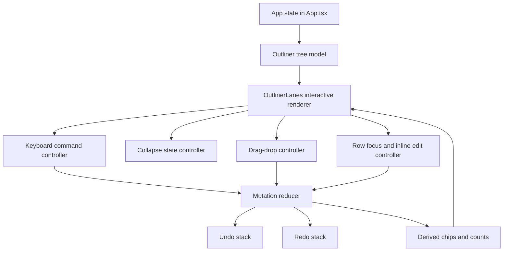
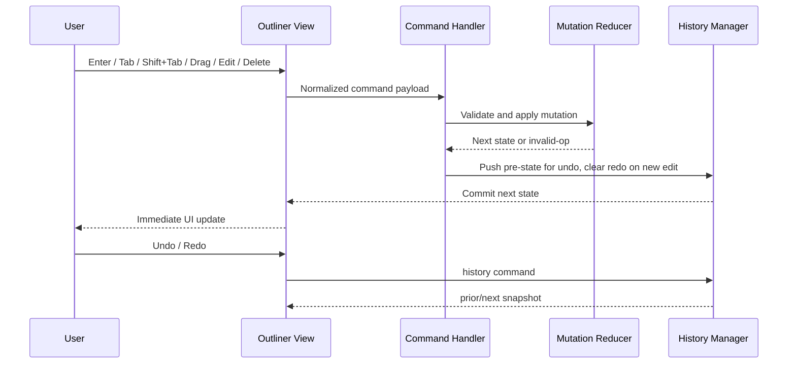

# PLAN — Frontend: Outliner (Phase 5)

**Date:** 2026-03-03
**REQ:** `.docs/reqs/2026/03/03/req-phase5-frontend-outliner.md`
**Status:** Draft (AP complete, SS complete, implementation and verification in progress)

---

## Architecture Overview

### Interaction Flow

---

## Implementation Phases

### Phase 5A - Tree shape and state boundaries (FR-OL1, FR-OL2, FR-OL5)

- [x] **5A-1** Define a normalized outliner node model (`activity/task/story`) with stable IDs and parent references for edit/move operations.
- [x] **5A-2** Add transformation helpers from existing `BoardColumnData` shape to outliner tree shape and back where needed.
- [x] **5A-3** Introduce in-session history state (`past/present/future`) in renderer state and helper utilities for push/undo/redo.
- [x] **5A-4** Add derived selectors for row chips (status, slug, doc refs) and child counts to keep render deterministic.

### Phase 5B - Interactive nested rendering (FR-OL1, FR-OL2)

- [x] **5B-1** Replace column-card rendering with nested block rows in `OutlinerLanes` while preserving activity/task/story hierarchy.
- [x] **5B-2** Add per-node collapse/expand toggle behavior for rows with children.
- [x] **5B-3** Keep collapse state stable across non-structural edits and resilient to node removal.
- [x] **5B-4** Render inline chips for stories (status, slug, doc refs) with consistent spacing and wrapping behavior.

### Phase 5C - Inline editing and block lifecycle commands (FR-OL3)

- [x] **5C-1** Implement row focus and inline title editing mode with commit-on-blur and Escape-to-cancel.
- [x] **5C-2** Implement Enter key to create a sibling block at the same hierarchy level with sensible default values.
- [x] **5C-3** Implement delete action with confirmation copy that includes descendant impact context.
- [ ] **5C-4** Ensure selection/focus lands on predictable target after create/delete operations.

### Phase 5D - Restructuring via keyboard and drag-drop (FR-OL4, FR-OL6)

- [x] **5D-1** Implement Tab indent operation with validation (must have previous valid sibling parent target).
- [x] **5D-2** Implement Shift+Tab outdent operation with validation (must have parent to outdent from).
- [x] **5D-3** Implement drag-start, drag-over, and drop handlers for same-parent reordering.
- [x] **5D-4** Extend drop logic to valid cross-parent moves while preserving node IDs and metadata.
- [ ] **5D-5** Surface non-blocking feedback for invalid restructure actions (no-op with visible hint/state).

### Phase 5E - Undo/redo command integration (FR-OL5)

- [x] **5E-1** Route all mutating outliner commands through a single reducer boundary to guarantee history coverage.
- [x] **5E-2** Implement undo/redo UI affordances (shortcuts and/or visible controls) scoped to outliner session state.
- [x] **5E-3** Clear redo branch when a new mutation occurs after undo.
- [ ] **5E-4** Verify undo/redo correctness for create/edit/delete/indent/outdent/drag-drop operations.

### Phase 5F - Tests and verification (AC-OL1 to AC-OL9)

- [x] **5F-1** Add component tests for nested rendering, collapse/expand, and chip visibility.
- [x] **5F-2** Add keyboard interaction tests for Enter sibling creation and inline title editing.
- [ ] **5F-3** Add deletion tests for confirmation behavior and descendant removal handling.
- [x] **5F-4** Add restructure tests for Tab/Shift+Tab and drag-drop cross-parent moves.
- [ ] **5F-5** Add history tests for undo/redo full coverage and redo-branch clearing.
- [x] **5F-6** Run `npm test --workspace=electron` and resolve failures.
- [x] **5F-7** Run `npm run build --workspace=electron` and verify successful build.

### Phase 5G - Validation and NFR closure (FR-OL6, NFR-OL1..NFR-OL5)

- [ ] **5G-1** Add explicit non-blocking invalid-action feedback assertions for keyboard restructure no-op cases.
- [ ] **5G-2** Add outliner-session integration tests in Electron renderer for undo/redo branch behavior after keyboard and drag-drop actions.
- [ ] **5G-3** Add NFR validation checklist (local-only behavior, deterministic state, and platform smoke notes for macOS/Windows/Linux).

---

## Data and Command Model

### Node Kinds

- `activity`
- `task`
- `story`

### Command Types (mutations)

- `edit-title`
- `create-sibling`
- `delete-node`
- `indent-node`
- `outdent-node`
- `move-node` (drag-drop)

### History Rules

- Each successful mutation pushes one snapshot to `past`.
- `undo` pops from `past` into `present`, pushing prior `present` into `future`.
- `redo` pops from `future` into `present`, pushing prior `present` into `past`.
- Any new successful mutation while `future` has items clears `future`.

---

## File-Level Change Plan

| File | Planned Change |
|------|----------------|
| `outliner/src/Outliner.tsx` | Implement nested interactive outliner rows, editing, keyboard commands, and structural mutation rules |
| `outliner/src/types.ts` | Define outliner node/page/prop contract for renderer integration |
| `outliner/tests/*` | Add/expand package tests for outliner editing, restructure operations, and caret/focus stability |
| `electron/renderer/src/App.tsx` | Introduce outliner mutation reducer and in-session undo/redo state wiring |
| `electron/renderer/src/components/Outliner.tsx` | Bridge renderer usage to shared `outliner` package component |
| `electron/renderer/src/components/storyMapMocks.ts` | Ensure mock data supports chips and restructure test coverage |
| `electron/tests/*` | Add/expand renderer integration tests for outliner history wiring and confirmation behavior |

---

## Risks and Mitigations

| Risk | Impact | Mitigation |
|------|--------|------------|
| Keyboard and inline-edit conflicts | Lost keystrokes or accidental commands | Strict editing mode guard; ignore structural shortcuts while text input is active |
| Drag-drop ambiguity across depths | Incorrect parent assignment | Use explicit drop targets and kind validation before commit |
| History snapshot size growth | Memory pressure in long sessions | Cap history depth (configurable constant) and use shallow immutable updates |
| Collapse state drift after restructure | Hidden nodes appear inconsistent | Recompute/validate collapse key set after every structural mutation |
| Selection instability after delete/move | Poor UX and accidental edits | Apply deterministic focus fallback (next sibling, previous sibling, then parent) |

---

## AR Review Loop

### Findings

- **Major Finding 1: Mutation paths can fragment quickly without a single reducer boundary.**
  - Risk: Undo/redo misses operations if some handlers mutate state directly.
  - Plan Update: All edit/restructure operations are routed through one command reducer (`5E-1`).

- **Major Finding 2: Keyboard shortcuts can conflict with inline edit mode.**
  - Risk: Pressing Tab/Enter while typing may trigger structural edits unexpectedly.
  - Plan Update: Add explicit editing-mode guards and command suppression during text entry (`5C-1`, `5D-*`).

- **Major Finding 3: Drag-drop cross-parent moves need type constraints.**
  - Risk: Invalid hierarchy (for example story under story) if target validation is weak.
  - Plan Update: Introduce strict node-kind validation before `move-node` commit (`5D-4`).

### AR Exit Condition

No unresolved major architecture flaws remain for Phase 5 implementation kickoff.

---

## Acceptance Mapping

| REQ Acceptance | Planned Validation |
|----------------|--------------------|
| AC-OL1 | Outliner package component tests confirm collapse/expand of descendants and stable row tree rendering |
| AC-OL2 | Renderer mapping tests verify story metadata chips (status/slug/doc refs) are represented and remain stable through outliner edits |
| AC-OL3 | Outliner package keyboard/edit tests validate immediate visible update on commit |
| AC-OL4 | Outliner package keyboard tests verify Enter creates same-level sibling block |
| AC-OL5 | Pending: renderer integration tests verify confirmation gating before removal and descendant impact copy |
| AC-OL6 | Outliner package keyboard tests verify valid Tab/Shift+Tab indent/outdent behavior |
| AC-OL7 | Outliner package model/keyboard tests verify reorder and valid cross-parent moves |
| AC-OL8 | Pending: renderer integration tests verify undo/redo across all mutation commands |
| AC-OL9 | Pending: renderer integration tests verify new mutation clears redo branch after undo |

---

## Execution Order

1. Introduce normalized tree model and history scaffolding in renderer state.
2. Replace outliner rendering with nested interactive block rows and chips.
3. Implement inline editing, Enter sibling creation, and delete confirmation.
4. Implement keyboard restructure and drag-drop with validity guards.
5. Integrate undo/redo across all mutation commands.
6. Add targeted tests, then run electron test/build verification.
