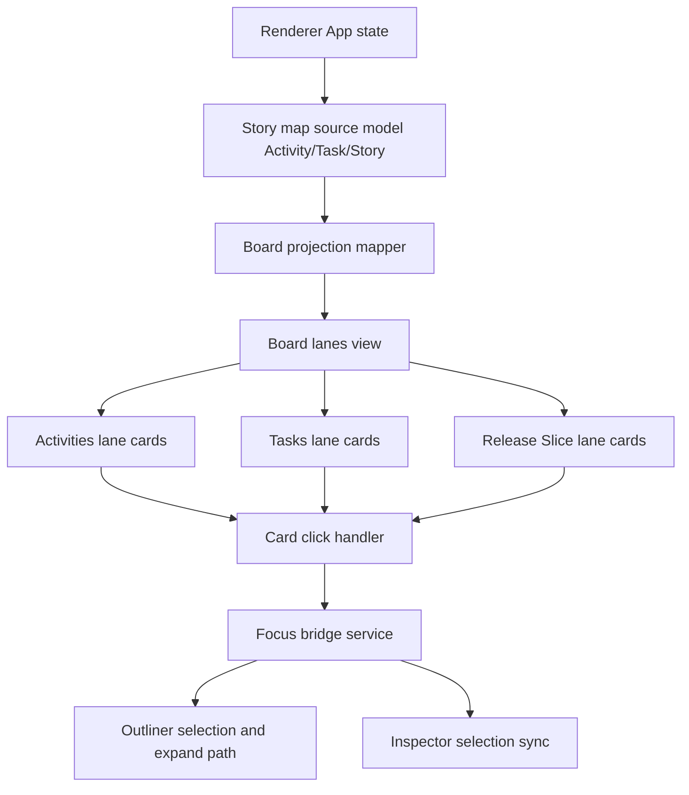
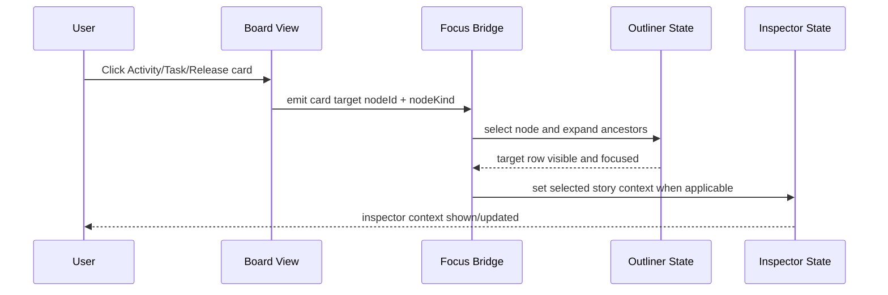

# PLAN — Frontend: User Story Map View (Phase 9)

**Date:** 2026-03-03
**REQ:** `.docs/reqs/2026/03/03/req-phase9-frontend-user-story-map-view.md`
**Status:** Draft (AP complete, SS mostly complete, verification in progress)

---

## Architecture Overview

### Interaction Flow

---

## Design and Model Decisions

1. The map board is a projection of existing outliner model data; no separate persisted board model is introduced in Phase 9.
2. `Tasks` is the only middle-lane label exposed in board UI (no `Backbone` fallback text).
3. Release Slice cards map to story-level nodes grouped by release metadata or derived slice index, while preserving stable story IDs for focus handoff.
4. Click-to-focus always routes through a single focus bridge function to keep outliner and inspector state transitions deterministic.

---

## Implementation Phases

### Phase 9A - View state and board entry wiring (FR-SM1, FR-SM6)

- [x] **9A-1** Add board view route/toggle integration within renderer shell without disrupting current outliner-first flows.
- [x] **9A-2** Add board container with horizontal scrolling behavior and lane scaffold.
- [x] **9A-3** Keep lane headers visible and clearly readable while board content scrolls.

### Phase 9B - Projection mapping: model to lanes (FR-SM1, FR-SM2, FR-SM3, FR-SM4)

- [x] **9B-1** Implement pure mapping utilities to project Activity/Task/Story hierarchy into lane card data with stable IDs.
- [x] **9B-2** Ensure middle lane naming is fixed to `Tasks` across labels, aria text, and tests.
- [x] **9B-3** Define task-column anchors for horizontal alignment and sequence order.
- [x] **9B-4** Define release slice grouping strategy per task with support for sparse and multi-row card stacks.

### Phase 9C - Lane rendering and alignment behavior (FR-SM2, FR-SM3, FR-SM4, FR-SM6)

- [x] **9C-1** Render Activities cards in top lane aligned to shared horizontal planning grid.
- [x] **9C-2** Render Tasks cards in middle lane aligned with activity group context.
- [x] **9C-3** Render Release Slice cards in bottom lane aligned under related task anchors.
- [x] **9C-4** Preserve alignment for tasks with zero slices and tasks with multiple slice rows.
- [x] **9C-5** Add explicit empty-state rendering for bottom lane when no release slices exist.

### Phase 9D - Click-to-focus bridge (FR-SM5)

- [x] **9D-1** Implement a card click handler contract that carries target node ID and semantic kind.
- [x] **9D-2** Implement focus bridge utility to select target node, expand ancestor chain, and reveal row in outliner.
- [x] **9D-3** Synchronize inspector selection for story-level targets and keep non-story selection behavior safe.
- [ ] **9D-4** Add fallback behavior for stale/missing node references (no crash, user feedback, and state remains consistent).

### Phase 9E - Accessibility and interaction polish (FR-SM1, FR-SM5, FR-SM6)

- [x] **9E-1** Ensure cards are keyboard-focusable with clear focus states.
- [x] **9E-2** Add semantic labels for lanes and cards (including task/slice relationships).
- [x] **9E-3** Confirm horizontal scroll usability on desktop and laptop viewport widths.

### Phase 9F - Tests and verification (AC-SM1 to AC-SM8)

- [x] **9F-1** Add mapper unit tests for lane projection, stable IDs, and release slice grouping edge cases.
- [x] **9F-2** Add component tests for lane order, labels (`Tasks`), and alignment placeholders.
- [ ] **9F-3** Add component/integration tests for card click focus handoff and ancestor expansion.
- [ ] **9F-4** Add inspector sync tests for story-level card clicks.
- [x] **9F-5** Run `npm test --workspace=electron` and resolve failures.
- [x] **9F-6** Run `npm run build --workspace=electron` and verify renderer build success.

---

## File-Level Change Plan

| File | Planned Change |
|------|----------------|
| `electron/renderer/src/App.tsx` | Add board view state wiring and map/outliner focus bridge integration points |
| `electron/renderer/src/components/BoardLanes.tsx` | Implement three-lane board rendering, alignment model, and card click hooks |
| `electron/renderer/src/components/storyMapTypes.ts` | Extend/normalize board projection and click-target typing |
| `electron/renderer/src/components/storyMapMocks.ts` | Add map fixtures with sparse and multi-slice release layouts |
| `electron/renderer/src/components/Outliner.tsx` | Expose/select/expand APIs needed by board click-to-focus integration |
| `electron/tests/*` | Add renderer tests for lane rendering, click-to-focus, and inspector handoff |

---

## Risks and Mitigations

| Risk | Impact | Mitigation |
|------|--------|------------|
| Ambiguous card-to-node mapping | Wrong outliner focus target | Use stable IDs and typed click payloads from projection layer |
| Collapsed outliner parents hide target | User perceives click failure | Always resolve ancestor chain and force-expand before focusing target |
| Alignment drift between task and slice lanes | Planning view loses clarity | Use shared task anchor coordinates and test alignment invariants |
| Large boards overflow viewport awkwardly | Reduced usability | Provide horizontal scroll container with sticky/readable lane headers |
| Missing/legacy release metadata | Incomplete slice rendering | Use safe fallback grouping and explicit empty placeholders |

---

## AR Review Loop

### Findings

- **Major Finding 1: Focus logic split across components risks inconsistent outliner/inspector synchronization.**
  - Risk: Card clicks may select in board but not fully reveal target in outliner.
  - Plan Update: Centralize all map card interactions through one focus bridge (`9D-2`, `9D-3`).

- **Major Finding 2: Release Slice alignment can regress if each lane computes independent ordering.**
  - Risk: Slice cards drift from related task columns.
  - Plan Update: Introduce shared task-anchor alignment model in projection and rendering (`9B-3`, `9C-3`).

- **Major Finding 3: Legacy language (`Backbone`) can leak into UI/tests if not normalized at source.**
  - Risk: Requirement mismatch and inconsistent terminology.
  - Plan Update: Lock middle-lane label and aria text to `Tasks` with explicit tests (`9B-2`, `9F-2`).

### AR Exit Condition

No unresolved major architecture flaws remain for Phase 9 implementation kickoff.

---

## Acceptance Mapping

| REQ Acceptance | Planned Validation |
|----------------|--------------------|
| AC-SM1 | Component tests verify board renders exactly three lanes in required order |
| AC-SM2 | Label/aria tests verify middle lane text is `Tasks` and excludes `Backbone` |
| AC-SM3 | Layout tests verify release cards align under related task anchors |
| AC-SM4 | Projection and rendering tests verify zero-slice tasks keep alignment structure intact |
| AC-SM5 | Integration tests verify card click selects and focuses corresponding outliner node |
| AC-SM6 | Integration tests verify story-level card click opens/updates inspector context |
| AC-SM7 | Integration tests verify ancestor expansion occurs before focus reveal |
| AC-SM8 | Interaction tests verify wide maps remain navigable via horizontal scrolling |

---

## Execution Order

1. Add board view entry wiring and lane scaffold.
2. Implement model-to-lane projection with stable IDs and task anchors.
3. Render Activities, Tasks, and Release Slice cards with alignment guarantees.
4. Integrate focus bridge for outliner/inspector handoff.
5. Add tests for projection, rendering, and click-to-focus behavior.
6. Run Electron workspace tests and build verification.