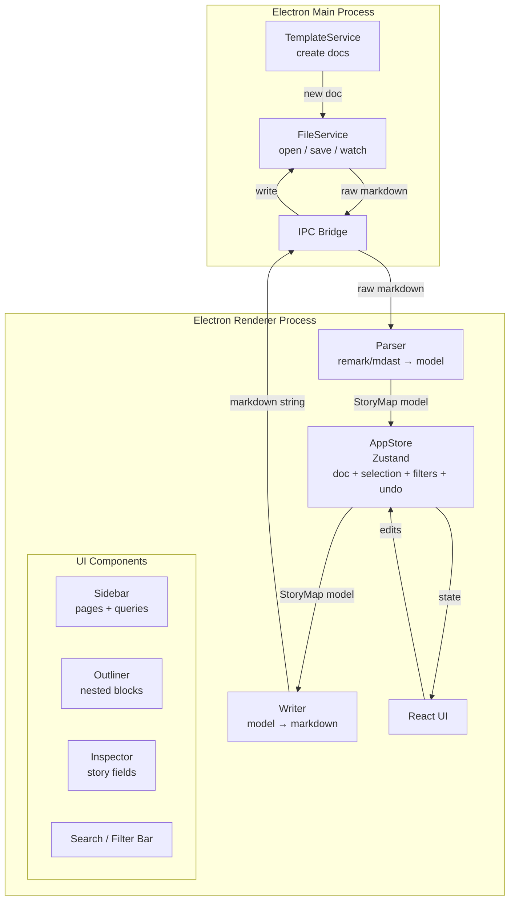
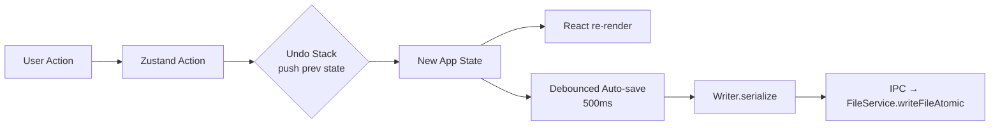

# Plan — User Story Map Manager

**Date:** 2026-03-02  
**REQ:** `.docs/reqs/2026/03/02/req-story-map-manager.md`  
**Status:** Draft

---

## Architecture Overview



---

## Module Breakdown

### Main Process
| Module | Responsibility |
|--------|---------------|
| `FileService` | `openDialog`, `readFile`, `writeFileAtomic` (temp + rename), `backupFile`, `watchFile` |
| `TemplateService` | resolve template, render `{slug}/{date}` tokens, write doc file |
| `IPC handlers` | Bridge between renderer and `FileService` / `TemplateService` |

### Renderer Process
| Module | Responsibility |
|--------|---------------|
| `parser/` | `parse(markdown): StoryMap` — remark/mdast → typed model |
| `writer/` | `serialize(StoryMap, formatMode): string` — model → markdown with minimal diff |
| `store/` | Zustand store — `StoryMap`, selection, filters, undo stack |
| `components/Sidebar` | Page list + saved query links |
| `components/Outliner` | Virtualized nested block tree, DnD, keyboard editing |
| `components/Inspector` | Story field forms, doc ref CRUD, actions |
| `components/SearchBar` | Full-text search input + filter chips |

---

## Data Model (TypeScript)

```ts
type Status = 'todo' | 'doing' | 'done';
type DocRefType = 'REQ' | 'PLAN' | 'DONE';

interface DocRef {
  id: string;
  type: DocRefType;
  date: string;       // YYYY-MM-DD
  filename: string;
}

interface Story {
  id: string;
  taskId: string;
  title: string;
  status: Status;
  slug: string;
  notes: string;
  order: number;
  docRefs: DocRef[];
  updatedAt: number;  // ms timestamp; set on every mutation — required for "Touched Recently" query
}

interface Task {
  id: string;
  activityId: string;
  title: string;
  order: number;
  stories: Story[];
}

interface Activity {
  id: string;
  title: string;
  order: number;
  tasks: Task[];
}

interface StoryMap {
  title: string;
  activities: Activity[];
}
```

---

## Parser / Writer Strategy

### Parser
- Use `remark` to parse the file into mdast.
- Walk the AST:
  - Identify `#activity`, `#task`, `#story` tags on list items.
  - Nest items by indentation level.
  - Extract story properties: scan child list items for `key:: value` lines (Form A) or `key:` patterns (Form B).
  - Extract doc refs: lines matching `YYYY-MM-DD → filename.md`.
- Return a typed `StoryMap`.

### Writer
- **Preserve Existing (default):** during parsing, record each story block's **byte-offset range** (`start`/`end`) in the source string. On save, reconstruct the output by splicing updated story text into the original source at those recorded offsets. This avoids fragile slug-based lookup and tolerates the user having renamed slugs externally between saves. Surrounding prose, whitespace, and non-story content are untouched.
- **Normalize to Properties:** rebuild the full document from the internal model using Form A encoding.
- Both modes: preserve unknown/unrecognized lines inside a story block to avoid data loss.

### Round-trip guarantee
- Golden fixture tests: parse → serialize → parse must yield identical model.

---

## State Management



- Undo stack: push immutable snapshots of `StoryMap` before each mutating action (cap at 100 entries).
- Selection, filters, and UI state are **not** part of the undo stack.
- Persisted state (format mode, workspace path, filter presets) stored in Electron `app.getPath('userData')` JSON config.

---

## IPC Contract

| Channel | Direction | Payload | Response |
|---------|-----------|---------|----------|
| `file:open-dialog` | R→M | — | `{ filePath: string \| null }` |
| `file:read` | R→M | `{ filePath }` | `{ content: string }` |
| `file:write` | R→M | `{ filePath, content }` | `{ ok: boolean }` |
| `file:watch` | R→M | `{ filePath }` | (event stream) |
| `file:unwatch` | R→M | `{ filePath }` | — |
| `file:changed` | M→R | `{ filePath }` | — |
| `template:create` | R→M | `{ type, slug, date, destDir }` | `{ filePath: string }` |
| `shell:open` | R→M | `{ filePath }` | — |

All IPC calls go through a typed `ipcRenderer.invoke` wrapper; no `remote` module usage.

> **Security:** The preload script must use `contextBridge.exposeInMainWorld` to expose only a strictly typed API object (e.g., `window.api.readFile(...)`). **Never** pass the raw `ipcRenderer` object into the renderer context — doing so would allow renderer-side XSS to invoke arbitrary IPC channels.

---

## Technology Choices

| Concern | Choice | Rationale |
|---------|--------|-----------|
| Framework | Electron + React + TypeScript | Cross-platform desktop, familiar ecosystem |
| Bundler | Vite + `electron-vite` | Fast HMR in renderer, simple main/preload split |
| Markdown parsing | `remark` + `mdast-util-*` | Mature AST, TypeScript types, pluggable |
| State | Zustand | Minimal boilerplate, easy immer integration for immutable undo |
| Immutability | `immer` | Structural sharing for undo snapshots; used via `zustand/middleware/immer` |
| DnD | `@dnd-kit/core` | Accessible, virtualization-friendly |
| Virtualization | `@tanstack/react-virtual` | Handles 10k+ items at < 50 ms |
| Testing | Vitest + Testing Library | Fast, jsdom compatible |
| Styling | Tailwind CSS | Utility-first, no runtime overhead |

---

## File / Folder Layout

```
rpd-command-center/
├── electron/
│   ├── main/
│   │   ├── index.ts          # app entry, window creation
│   │   ├── fileService.ts
│   │   ├── templateService.ts
│   │   └── ipcHandlers.ts
│   └── preload/
│       └── index.ts          # contextBridge expose
├── src/
│   ├── parser/
│   │   ├── parse.ts
│   │   ├── parseProperties.ts
│   │   └── parseDocRefs.ts
│   ├── writer/
│   │   ├── serialize.ts
│   │   └── preserveWriter.ts
│   ├── store/
│   │   ├── store.ts          # Zustand root store
│   │   ├── undoSlice.ts
│   │   ├── filterSlice.ts
│   │   └── selectionSlice.ts
│   ├── components/
│   │   ├── Sidebar/
│   │   ├── Outliner/
│   │   │   ├── OutlinerTree.tsx
│   │   │   ├── BlockRow.tsx
│   │   │   └── InlineChips.tsx
│   │   ├── Inspector/
│   │   │   ├── InspectorPanel.tsx
│   │   │   ├── DocRefList.tsx
│   │   │   └── SlugInput.tsx
│   │   └── SearchBar/
│   ├── types/
│   │   └── model.ts          # StoryMap, Activity, Task, Story, DocRef
│   ├── utils/
│   │   └── slugValidation.ts
│   └── App.tsx
├── tests/
│   ├── parser/
│   │   └── fixtures/         # golden .md files
│   └── writer/
├── user-story-map.md
├── package.json
└── vite.config.ts
```

---

## Phased Implementation Plan

### Phase 0 — Foundations
- [ ] Init Electron + Vite + React + TypeScript project (`electron-vite` template)
- [ ] Configure Tailwind CSS
- [ ] Set up Vitest with jsdom
- [ ] Implement `FileService`: `openDialog`, `readFile`, `writeFileAtomic`, `backupFile`
- [ ] Wire IPC handlers and preload `contextBridge`
- [ ] App shell: window launches, opens workspace folder, displays filename
- [ ] CI: lint + test script

### Phase 1 — Parser & Writer
- [ ] Define TypeScript data model (`types/model.ts`)
- [ ] Implement `parse.ts`: remark → mdast → `StoryMap` (Form A + Form B support)
- [ ] Write golden fixture tests (round-trip: parse → serialize → parse)
- [ ] Implement `serialize.ts` (Normalize mode)
- [ ] Implement `preserveWriter.ts` (Preserve Existing mode)
- [ ] Implement `FileService.watchFile` + `file:changed` IPC event
- [ ] Zustand store: load file, hold `StoryMap`

### Phase 2 — Outliner Core
- [ ] `OutlinerTree`: render nested Activity → Task → Story rows (virtualized)
- [ ] `BlockRow`: collapse/expand, inline edit title
- [ ] `InlineChips`: status pill, slug mono, REQ/PLAN/DONE chips
- [ ] Keyboard: Enter (new sibling), Tab/Shift+Tab (indent/outdent), Delete
- [ ] DnD reorder within same parent (`@dnd-kit`)
- [ ] Move block across parents
- [ ] Undo/redo (in-session, 100-entry stack)
- [ ] Debounced auto-save (500 ms after last edit)

### Phase 3 — Inspector & Validation
- [ ] `InspectorPanel`: opens on story selection
- [ ] Edit title, status dropdown, notes
- [ ] `SlugInput`: real-time uniqueness validation, character restriction
- [ ] `DocRefList`: add / edit / remove doc refs
- [ ] Open doc in system editor (`shell:open` IPC)
- [ ] Copy doc ref path to clipboard
- [ ] Inspector actions: Mark Done, Move picker, Duplicate, Copy as Markdown

### Phase 4 — Search, Filters & Queries
- [ ] `SearchBar`: full-text search (title + slug + notes + doc filenames)
- [ ] Highlight matching text in `BlockRow`
- [ ] Filter chips: status multi-select, doc coverage, unfinished tasks
- [ ] Saved query engine: evaluate query predicates against `StoryMap`
- [ ] Sidebar: "Doing", "No Docs", "Touched Recently", "By Status" links
- [ ] Persist named filter presets to config JSON

### Phase 5 — Zoom / Focus Mode
- [ ] Click Activity/Task → push focused node to navigation stack
- [ ] Focused view: render only children of focused node
- [ ] Progress summary bar: counts by status + percent done
- [ ] Doc coverage summary
- [ ] Aggregated doc refs list (clickable → `shell:open`)
- [ ] Back navigation (breadcrumb or Escape key)

### Phase 6 — Doc Templates
- [ ] `TemplateService`: load template file, render tokens (`{slug}`, `{date}`, `{type}`)
- [ ] `template:create` IPC handler
- [ ] Inspector "Create REQ/PLAN/DONE" action: invoke `template:create`, get back path, insert doc ref
- [ ] Default template files bundled in app resources
- [ ] Settings UI: configure template folder + custom templates

### Phase 7 — Polish & Config
- [ ] Format Mode setting (Preserve / Normalize) — persisted
- [ ] External file change detection → modal "File changed externally. Reload?"
- [ ] Backup config toggle in settings
- [ ] Activity/Task progress indicators inline (status counts + %)
- [ ] Keyboard shortcut cheat sheet overlay (press `?`)
- [ ] Parse warning / error panel (non-blocking toast or collapsible banner)
- [ ] Accessibility pass: keyboard-only navigation, ARIA labels on all interactive elements

---

## Testing Strategy

| Layer | Tool | Focus |
|-------|------|-------|
| Parser / Writer | Vitest | Golden fixture round-trips, edge cases (empty file, malformed lines, unicode) |
| Store actions | Vitest | Mutation correctness, undo/redo stack integrity |
| Components | Vitest + Testing Library | Render, keyboard events, inspector form validation |
| IPC | Vitest (mock `ipcRenderer`) | Channel payloads, error handling |
| E2E | `@playwright/test` (Electron launch API) | Open file → edit → save → verify file contents (Phase 7) |

---

## Risk Register

| Risk | Likelihood | Impact | Mitigation |
|------|-----------|--------|------------|
| Markdown round-trip drift | Medium | High | Preserve mode + golden tests; minimize-diff writer |
| Ambiguous user-edited markdown | Medium | Medium | Tolerant parser with best-effort import + warnings |
| Performance on 10k block files | Low-Medium | High | `@tanstack/react-virtual` virtualized list; defer parse on idle |
| Cross-platform file-watch edge cases | Medium | Medium | Debounce + explicit Reload UI; tested on all three OS |
| DnD + undo stack conflicts | Low | Medium | Commit DnD result as single undo entry after drop |

---

## Open Questions (carry-over from REQ)

1. **Format Mode default** — "Preserve Existing" confirmed as default; "Normalize" opt-in.
2. **Linked doc viewer** — v1 delegates to system editor (`shell.openPath`); embedded viewer is post-v1.
3. **Undo persistence** — in-session only for v1; persistent history deferred.
